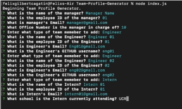

# Team Profile Generator

## Demo
  

## Table of Contents
[Description](#description)  
[Installation](#installation)  
[Contribute](#contribute)  
[Test](#test)  
[Questions](#questions)  
 

## Description
A simple command-line application to display information about employees on a software engineering team. Based on a series of prompts given to a user, this application will generate an HTML page consisting of summaries of each individual employee on the team.  

## Installation
First, in the command line, install the necessary dependencies by running npm install in the root directory. Then, to run the generation process, simply run node index.js to begin.  

## Usage
Used to display information about a software engineering team.  

## Contribute
Fork the repository and submit a pull request.  

## Test
In the __test__ directory, run npm test to run all the test files.  

## Questions? 
Reach me at the following with your questions:  
Github Username: cagatin  
Email:  cagatingilbert@gmail.com  
 
